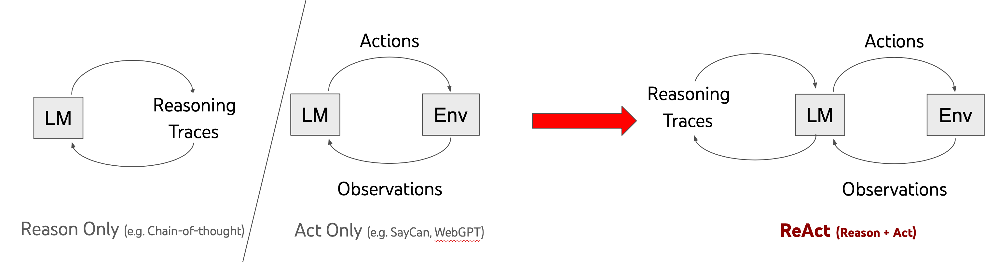
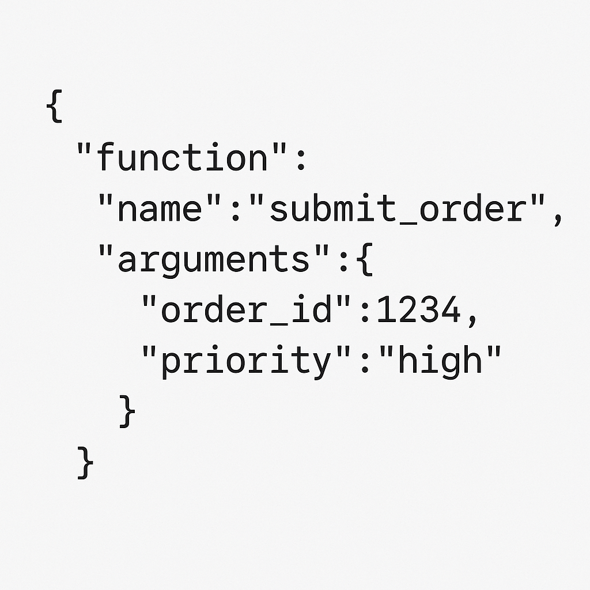
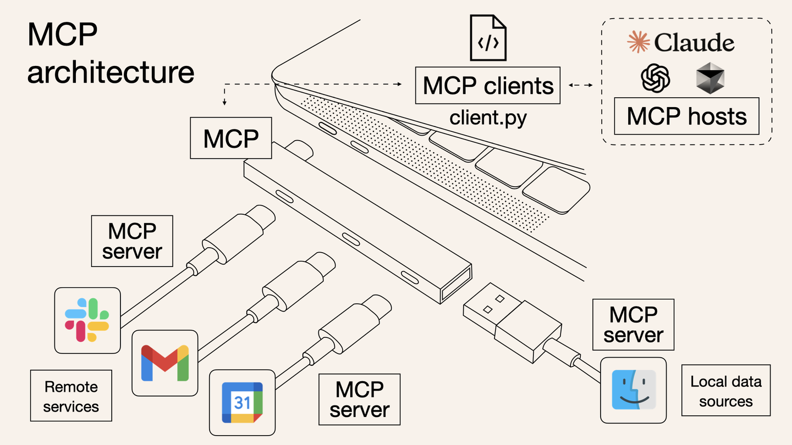
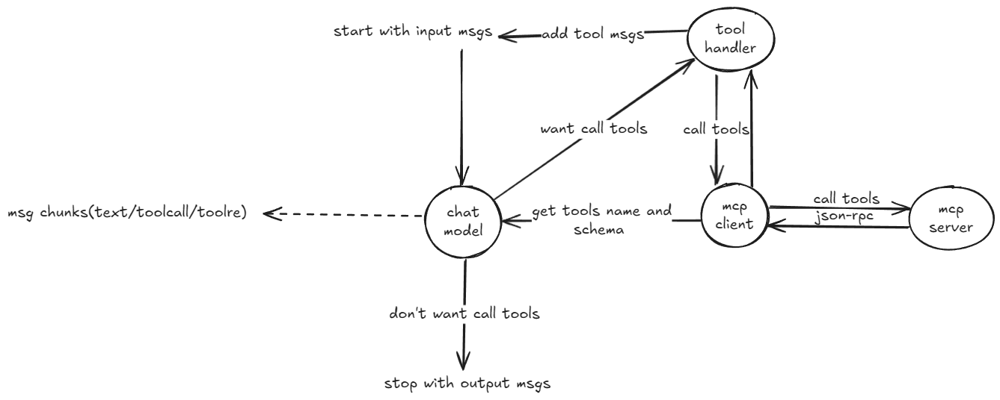
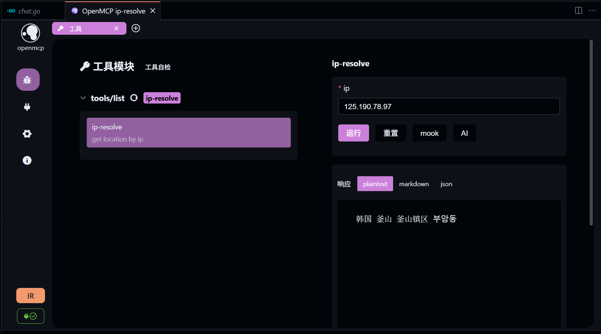
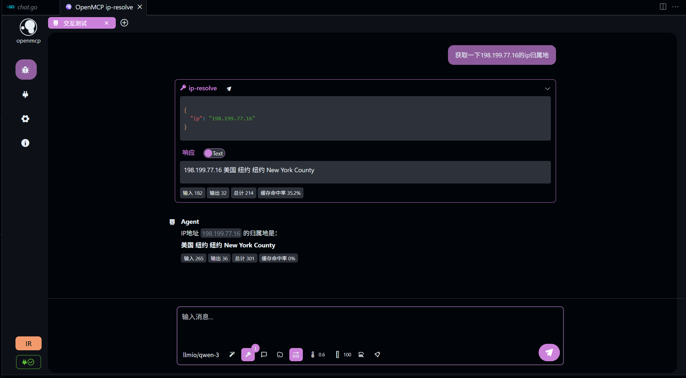
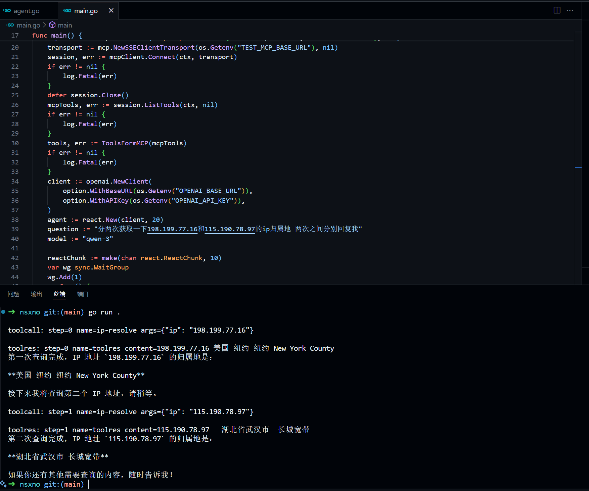

+++
date = '2025-07-22T16:01:07+08:00'
title = 'React Agent与MCP'
+++

2025年的今天，大语言模型的能力早已不再限于chatbot(只会聊天)，各家模型都在文本预测的基础上扩展LLM的能力，例如Structured Outputs(结构化输出)，Function calling(函数调用)，MCP(模型上下文协议)，同时，有人提出一种结合LLM思考与行动的协同机制-React。

## React Agent
通过让LLM循环执行 推理(Reasoning)->行动(Action)->观察(Observation) 来完成任务。

[ReAct: Synergizing Reasoning and Acting in Language Models](https://react-lm.github.io/)

[eino-React实现](https://www.cloudwego.io/zh/docs/eino/core_modules/flow_integration_components/react_agent_manual/)

## Function calling
LLM自身训练的结构化输出能力以及通过openai-api服务实现，让LLM能够按照指定格式输出json格式的数据，来表明自己需要去使用什么函数，参数是什么，同时支持流式生成。
例如:

之后你应该在输入的messages里面加入除user,assistant的另一个角色，名为tool，tool的content内容为函数调用结果，至于函数是如何调用，LLM和openai-api服务并不参与，由开发者执行。此时再次对话，LLM会根据上下文中函数调用结果生成回答。

[openai-function-calling](https://platform.openai.com/docs/guides/function-calling?api-mode=chat)

## MCP
MCP (Model Context Protocol)是一种开放协议，用于标准化应用程序如何向大型语言模型（LLMs）提供上下文。可以将 MCP 想象为 AI 应用的 typec 接口。正如 typec 提供了一种标准化的方式将您的设备连接到各种外设和配件，MCP 也提供了一种标准化的方式，将 AI 模型连接到不同的数据源和工具。

以工具为例，我们可以通过 MCP Client 获取 MCP Server 提供的工具提供给LLM，并根据LLM所要调用的函数向 MCP Server发起远程函数调用，并将函数返回结果使用上文提到的方式加入上下文中。

**MCP可以是函数定义与函数执行的一个实现方式**

每个人都遵守MCP协议，就可以很方便将自己的写的函数(工具+)让别人的大模型接入调用，这也是协议的意义。


此处不再过多赘述，详情参考:

[官方文档](https://modelcontextprotocol.io/introduction)

[OpenMcp-what-is-mcp](https://kirigaya.cn/openmcp/zh/plugin-tutorial/what-is-mcp.html)

## 整合架构图

看完上文，你应该能对MCP，Function calling 与 React Agent 之间的关系有所了解。

## 实践
接下来我会用Golang以及[openai-go](https://github.com/openai/openai-go)与[mcp-go-sdk](github.com/modelcontextprotocol/go-sdk)对上图各个部分实现一个最简MVP版本。

依赖:
```bash
go get -u github.com/modelcontextprotocol/go-sdk
go get -u github.com/openai/openai-go
```

### MCP Server
包含一个最简的输入ip返回ip归属地信息的工具的 MCP Server SSE实现，可以通过docker一键运行。

[github仓库](https://github.com/atopos31/oneip)

这个仓库使用的是mcp-go的v0.1.0版本，和目前最新的v0.2.0有很大不同。

部署完成后，推荐使用vscode插件[openmcp](https://kirigaya.cn/openmcp/zh/)进行工具调用测试。

实际上，openmcp也是上面架构图的实现。

### MCP Client
初始化一个session
```go
func main() {
	ctx := context.Background()
	mcpClient := mcp.NewClient(&mcp.Implementation{Name: "mcp-client", Version: "v1.0.0"}, nil)
	transport := mcp.NewSSEClientTransport(os.Getenv("TEST_MCP_BASE_URL"), nil)
	session, err := mcpClient.Connect(ctx, transport)
	if err != nil {
		log.Fatal(err)
	}
	defer session.Close()
}
```
根据上图，MCP client主要负责提供函数定义和调用功能。
#### ListTools
从 MCP Server获取工具列表
```go
mcpTools, err := session.ListTools(ctx, nil)
if err != nil {
	log.Fatal(err)
}
```
#### ToolCall
通过对应工具名称和输入参数调用远程的MCP tool。
```go
res, err := session.CallTool(ctx, &mcp.CallToolParams{
	Name:      "ip-resolve",
	Arguments: `{"ip": "198.199.77.16"}`,
})
if err != nil {
	return nil, err
}
```
### ChatModel
这是整个React Agent的核心部分，最好的体验是流式会话。
```go
client := openai.NewClient(
	option.WithBaseURL(os.Getenv("OPENAI_BASE_URL")),
	option.WithAPIKey(os.Getenv("OPENAI_API_KEY")),
)
client.Chat.Completions.NewStreaming(ctx, openai.ChatCompletionNewParams{
	Tools: []openai.ChatCompletionToolParam{},
})
```
#### 工具转换
MCP client获取到的工具列表需要转换成openai-go可以接受的工具列表格式。
```go
func ToolsFormMCP(list *mcp.ListToolsResult) ([]openai.ChatCompletionToolParam, error) {
	var tools []openai.ChatCompletionToolParam
	for _, tool := range list.Tools {
		var toolParam openai.ChatCompletionToolParam
		data, err := json.Marshal(tool.InputSchema)
		if err != nil {
			return nil, err
		}
		if err := json.Unmarshal(data, &toolParam.Function.Parameters); err != nil {
			return nil, err
		}
		toolParam.Function.Name = tool.Name
		toolParam.Function.Description = openai.String(tool.Description)
        //可选，严格模式
		toolParam.Function.Strict = openai.Bool(true)
		toolParam.Function.Parameters["additionalProperties"] = false
		tools = append(tools, toolParam)
	}
	return tools, nil
}
```
有关工具调用具体参数详见[openai-api文档](https://platform.openai.com/docs/guides/function-calling?api-mode=chat&strict-mode=enabled#handling-function-calls)
#### 流式会话
这里使用了Go1.23新增的迭代器模式简化，有关迭代器参考[关于Golang新增的迭代器](https://heyxiao.top/posts/iterator/)。

acc可以用来收集本次完整响应msg。

不仅是生成的文本，函数调用的参数也是流式的，需要我们自行拼接。
```go
var acc openai.ChatCompletionAccumulator
toolCalls := make(map[int64]*openai.ChatCompletionChunkChoiceDeltaToolCall)
stream := client.Chat.Completions.NewStreaming(ctx, params)
for chunk := range Chunks(stream) {
    acc.AddChunk(chunk)
	if len(chunk.Choices) < 1 {
		continue
	}
	content := chunk.Choices[0].Delta.Content

    for _, call := range chunk.Choices[0].Delta.ToolCalls {
				if _, ok := toolCalls[call.Index]; !ok {
					toolCalls[call.Index] = &call
					continue
				}
				toolCall := toolCalls[call.Index]
				toolCall.Function.Arguments += call.Function.Arguments
    }
}
newmsg := acc.ChatCompletion.Choices[0].Message.ToParam()
```
```go
func Chunks[T any](stream *ssestream.Stream[T]) iter.Seq[T] {
	return func(yield func(T) bool) {
		for stream.Next() {
			if !yield(stream.Current()) {
				return
			}
		}
	}
}
```
如何判断某个函数调用的参数已经拼接完成呢？我的办法是使用一个三方库[gjson](https://github.com/tidwall/gjson)，gjson有一个方法可以判断一个string是否是合法的json字符串，如果合法，意味着该函数参数已经拼接完成。
```bash
go get -u github.com/tidwall/gjson
```
```go
if gjson.Valid(toolCall.Function.Arguments) {
    //根据参数调用函数
}
```
#### 工具调用(tool handler)
根据chat model输出的tool name与arguments，调用远程 MCP Server对应的函数。
```go
func McpToolHandler(session *mcp.ClientSession) ToolHandle {
	return func(ctx context.Context, call openai.ChatCompletionChunkChoiceDeltaToolCallFunction) (*openai.ChatCompletionToolMessageParamContentUnion, error) {
		var args json.RawMessage
		if err := json.Unmarshal([]byte(call.Arguments), &args); err != nil {
			return nil, err
		}

		res, err := session.CallTool(ctx, &mcp.CallToolParams{
			Name:      call.Name,
			Arguments: args,
		})
		if err != nil {
			return nil, err
		}
		content := ""
		for _, c := range res.Content {
			content += c.(*mcp.TextContent).Text
		}
		return &openai.ChatCompletionToolMessageParamContentUnion{
			OfString: openai.String(content),
		}, nil
	}
}
```
### React Agent
前置准备完毕，现在可以循环Re起来了！每次调用完成后如果toolCalls不为0，向下一轮对话加入本次回复的msg与tool msgs，重新进行对话，直到toolCalls为0，结束React。

完整代码详见[github仓库](https://github.com/atopos31/nsxno)


## 总结
一个完整React Agent 配合 MCP tools，由纯Golang实现，现在很多教程都在讲MCP Server的实现，缺少完整的教程,所以这篇博客还是很有价值的。字节的eino框架也实现了一个[React Agent](https://www.cloudwego.io/zh/docs/eino/core_modules/flow_integration_components/react_agent_manual/)，不过代码复杂，不适合快速学习。动手实现对于理解MCP Agent Function calling帮助很大！
