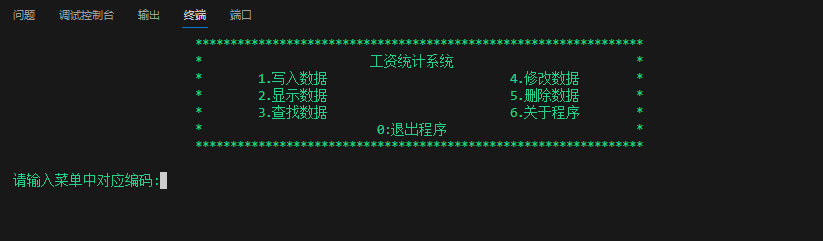

+++
date = '2022-12-05T23:11:11+08:00'
title = '我的第一份C语言代码'
+++
## 运行

这段代码写于2022年期末，作为C语言课程设计。

```c
#include <stdio.h>
#include <stdbool.h>
#include <string.h>
#include <windows.h>
#include <time.h>

typedef struct worker_data // 定义保存员工数据的结构体
{
    int Number;          // 编号
    char Name[10];       // 姓名
    char Department[10]; // 部门
    int Wages_payable;   // 应付工资
    int Insurance;       // 保险
    int Taxes;           // 税金
    int Real_wags;       // 实付工资
} WD;

void fpWrite(void);   // 写入数据
void fpRade(void);    // 显示数据
void fpInquire(void); // 查找数据
void fpChange(void);  // 修改数据
void fpDelete(void);  // 删除数据
void about_h(void);   // 关于程序
void cls(void);       // 清屏
void color(int c);    // 改变文字颜色
void putss(WD *PT);   // 打印数据函数
void getss(WD *GT);   // 写入数据函数

int main()
{
    while (true) // true是stdbool包中的宏定义，编译时会自动替换为1
    {
        cls(); // 清屏 改变字体颜色 打印菜单栏
        system("color 0A");
        printf("                          ****************************************************************\n");
        printf("                          *                        工资统计系统                          *\n");
        printf("                          *        1.写入数据                          4.修改数据        *\n");
        printf("                          *        2.显示数据                          5.删除数据        *\n");
        printf("                          *        3.查找数据                          6.关于程序        *\n");
        printf("                          *                         0:退出程序                           *\n");
        printf("                          ****************************************************************\n\n");

    _maed:
        printf("请输入菜单中对应编码:"); // 通过不同的x值来进入不同函数，实现不同功能

        int x;
        scanf("%d", &x);

        if (x == 1)
        {
            fpWrite();
        }
        else if (x == 2)
        {
            fpRade();
        }
        else if (x == 3)
        {
            fpInquire();
        }
        else if (x == 4)
        {
            fpChange();
        }
        else if (x == 5)
        {
            fpDelete();
        }
        else if (x == 6)
        {
            about_h();
        }
        else if (x == 0)
        {
            return 0;
        }
        else
        {
            printf("未知的指令:请在0~6中选择输入!\n");
            goto _maed;
        }
    }
};

void fpWrite(void)
{
_Wsz:

    cls();
    WD workerW;
    getss(&workerW);

    FILE *fp = fopen("workerdata.txt", "a");  // 以写入方式打开数据文件，并定义文件指针指向该文件
    fwrite(&workerW, sizeof(workerW), 1, fp); // 将结构体中的数据以二进制方式写入文件中
    fclose(fp);                               // 关闭文件指针

    cls();
    printf("写入完成！\n");
    printf("输入1继续写入,输入0返回菜单！");
_Wsz2:
    int num;
    scanf("%d", &num);
    if (num == 1)
    {
        goto _Wsz;
    }
    else if (num == 0)
    {
        return;
    }
    else
    {
        printf("未知的指令！请重新输入！");
        goto _Wsz2;
    }
}

void fpRade(void)
{
    cls();
    printf("                                                    全部工资信息如下:                        \n\n");
    WD workerR;
    FILE *fp = fopen("workerdata.txt", "r");        // 以只读的方式打开数据文件，并定义文件指针指向该文件
    while (fread(&workerR, sizeof(workerR), 1, fp)) // 循环读取文件指针的二进制数据，并打印
    {
        putss(&workerR);
    }
    fclose(fp);

    printf("\n输入0返回菜单\n");
_Rsiz:
    int k;
    scanf("%d", &k);

    if (k == 0)
    {
        cls();
        return;
    }
    else
    {
        printf("输入的数据不对，请重新输入！\n"); // 下面的goto语句来实现重新输入
        goto _Rsiz;
    }
}

void fpInquire(void)
{
    cls();
_Isz:
    char stud[3][10] = {"编号", "姓名", "部门"};
    char a[10] = {0};
    int size;
    int size2;
    int inumber;
    WD workerI;

    printf("1.按编号查找\n2.按姓名查找\n3.按部门查找\n0.返回上一级\n\n");

    printf("请输入对应编号选择功能:");
    scanf("%d", &size);
_Isz3:
    cls();
    printf("请输入您要查找的%s:", stud[size - 1]);

    if (size == 1)
    {
        int a1 = 1;
        scanf("%d", &inumber);
        FILE *fp = fopen("workerdata.txt", "r");
        printf("编号%d的员工数据如下:\n", inumber);
        while (fread(&workerI, sizeof(workerI), 1, fp)) // 循环读取文件指针的二进制数据，并打印
        {
            if (workerI.Number == inumber)
            {
                putss(&workerI);
                a1 = 0;
            }
        }
        fclose(fp);

        if (a1 == 1)
        {
            printf("\n没有找到编号为%d的员工!请重新输入！\n", inumber);
            goto _Isz3;
        }
    }
    else if (size == 2)
    {
        int a2 = 0;
        scanf("%s", a);
        FILE *fp = fopen("workerdata.txt", "r");
        while (fread(&workerI, sizeof(workerI), 1, fp)) // 循环读取文件指针的二进制数据，并打印
        {
            if (strcmp(workerI.Name, a) == 0)
            {
                printf("员工%s数据如下:\n", a);
                putss(&workerI);
                a2 = 1;
            }
        }
        *a = 0;
        fclose(fp);

        if (a2 == 0)
        {
            printf("\n没有找到姓名为%s的员工!请重新输入！\n", a);
            goto _Isz3;
        }
    }
    else if (size == 3)
    {
        int a3 = 0;
        int allnum = 0;
        int numj = 0;
        scanf("%s", a);
        FILE *fp = fopen("workerdata.txt", "r");
        printf("部门%s的数据如下:\n", a);
        while (fread(&workerI, sizeof(workerI), 1, fp)) // 循环读取文件指针的二进制数据，并打印
        {
            if (strcmp(workerI.Department, a) == 0)
            {
                putss(&workerI);
                allnum += workerI.Real_wags;
                numj++;
                a3 = 1;
            }
        }

        *a = 0;
        fclose(fp);

        if (a3 == 0)
        {
            printf("\n没有找到部门为%s的员工!请重新输入！\n", a);
            goto _Isz3;
        }

        printf("\n总工资:%d\n平均工资:%lf\n", allnum, 1.0 * allnum / numj);
    }
    else
    {
        return;
    }

_Isz2:
    printf("\n输入1继续查找,输入0返回菜单:\n");
    scanf("%d", &size2);

    if (size2 == 1)
    {
        cls();
        goto _Isz;
    }
    else if (size2 == 0)
    {
        return;
    }
    else
    {
        printf("未知的指令,请重新输入！\n");
        goto _Isz2;
    }
}

void fpChange(void)
{
    cls();
_Csiz1:
    printf("请输入要修改人员的姓名(输入0返回菜单):");
    char name[10] = {0};
    scanf("%s", name);

    if (strcmp(name, "0") == 0)
    {

        cls();
        return;
    }

    WD workerC;
    int i = 1;

    FILE *fp = fopen("workerdata.txt", "r+b");
    while (fread(&workerC, sizeof(workerC), 1, fp))
    {
        if (strcmp(workerC.Name, name) == 0)
        {
            printf("%s的数据如下:\n", name);

            putss(&workerC);

            fseek(fp, -(long int)sizeof(workerC), SEEK_CUR);

            i = 0;
            break;
        }
    }

    if (i == 1)
    {
        printf("没有找到这个人，请重新输入!\n");
        goto _Csiz1;
    }

    printf("请输入修改后的数据！\n");
    getss(&workerC);

    fwrite(&workerC, sizeof(workerC), 1, fp);
    fclose(fp);

    printf("修改完成！\n输入1继续修改,输入0返回菜单!\n");
    int k;
    scanf("%d", &k);
    if (k == 1)
    {
        goto _Csiz1;
        cls();
    }
    else if (k == 0)
    {
        cls();
        return;
    }
}

void fpDelete(void)
{
    cls();
_release:
    printf("请输入想要删除的人员的名称(输入0返回上级):");
    char name[10] = {0};
    scanf("%s", name);

    if (strcmp(name, "0") == 0)
    {
        cls();
        return;
    }

    FILE *file = fopen("workerdata.txt", "r");
    fseek(file, 0, SEEK_END);
    int num = ftell(file) / sizeof(WD);
    fseek(file, 0, SEEK_SET);

    WD *all = (WD *)malloc(num * sizeof(WD));
    WD *const start = all;
    while (fread(all++, sizeof(WD), 1, file))
        ;
    fclose(file);

    WD *news = (WD *)malloc((num - 1) * sizeof(WD));
    WD *const newIndex = news;

    int offset = 0;
    for (int i = 0; i < num; ++i)
    {
        if (strcmp(name, start[i].Name) == 0)
        {
            offset = 1;
            printf("%s的数据如下:\n", name);
            putss(start);
            continue;
        }
        *news++ = start[i];
    }

    if (offset == 0)
    {
        cls();
        printf("没有找到这个人，请重新输入!\n");
        goto _release;
    }

    printf("输入yes确认删除数据:");
    scanf("%s", name);
    if (strcmp(name, "yes") == 0)
    {
        cls();
        printf("删除完成！");

        system("del /f /s workerdata.txt");
        FILE *w = fopen("workerdata.txt", "w");
        fwrite(newIndex, sizeof(WD), num - 1, w);
        fclose(w);
    }

    free(start);
    free(newIndex);

    printf("输入1继续删除,输入0返回菜单！\n");
_stu:
    int k;
    scanf("%d", &k);
    if (k == 1)
    {
        cls();
        goto _release;
    }
    else if (k == 0)
    {
        return;
    }
    else
    {
        cls();
        printf("您输入的数据有误，请重新输入！\n");
        goto _stu;
    }
}

void about_h(void)
{
    int x, y;
    int dx, dy;

    cls();
    for (int i = 1; i < 20; i++)
    {

        printf(" /\\_/\\ \n( o.o )\n  >^<  \n /^\\/^\\\n");
        if (i < 15)
        {
            color(i);
        }
        else
        {
            color(i - 15);
        }
        printf("\n\n\n\n\n\n\n\n\n\n\n\n");
        printf("                                                 ");
        for (int j = 0; j < i; j++)
        {
            printf("* ");
        }
        printf("\n                                                 感谢您使用本程序！\n");
        printf("\n                                                 作者:肖嘉兴  版本:V2.4\n");
        printf("                                                 了解源代码，请访问-->hackerxiao.online\n");
        printf("                                                 ");
        for (int j = 0; j < i; j++)
        {
            printf("* ");
        }
        Sleep(200);

        cls();
    }
}

void cls(void)
{
    system("CLS");
}

void color(int c)
{
    SetConsoleTextAttribute(GetStdHandle(STD_OUTPUT_HANDLE), c);
}

void putss(WD *PT)
{
    printf("\n编号:%d ", PT->Number);
    printf("\t姓名:%s ", PT->Name);
    printf("\t部门:%s ", PT->Department);
    printf("\t应付工资:%d ", PT->Wages_payable);
    printf("\t保险:%d ", PT->Insurance);
    printf("\t税金:%d ", PT->Taxes);
    printf("\t实付工资:%d \n", PT->Real_wags);
}

void getss(WD *PT)
{
    printf("编号:");
    scanf("%d", &PT->Number);
    printf("姓名:");
    *PT->Name = 0;
    scanf("%s", PT->Name);
    printf("部门:");
    *PT->Department = 0;
    scanf("%s", PT->Department);
    printf("应付工资:");
    scanf("%d", &PT->Wages_payable);
    printf("保险:");
    scanf("%d", &PT->Insurance);
    printf("税金:");
    scanf("%d", &PT->Taxes);
    PT->Real_wags = PT->Wages_payable - PT->Insurance - PT->Taxes;
}
```

