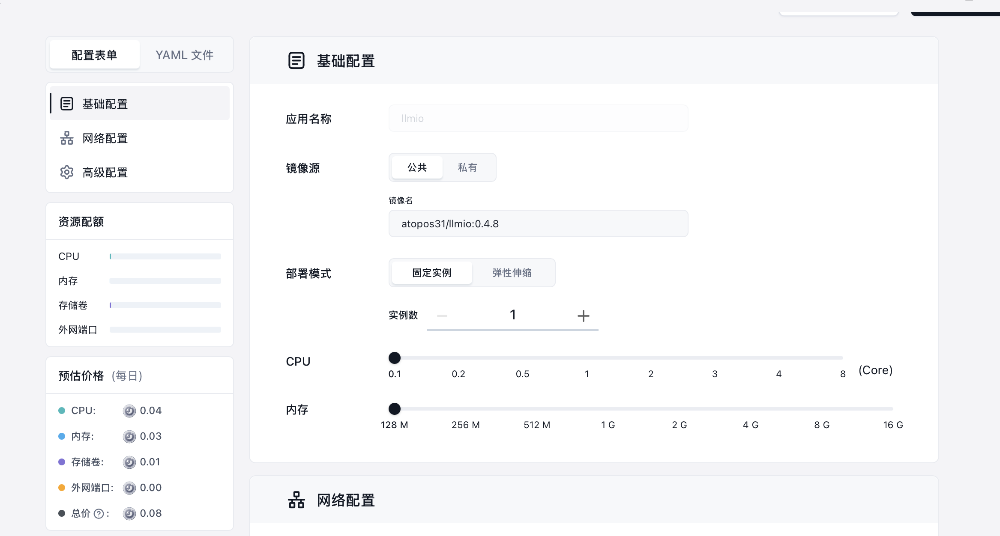

+++
date = '2025-09-05T15:48:18+08:00'
title = '为Go web程序构建并发布docker镜像'
tags = ["go","docker"]
+++

## 容器化时代，部署web项目早已不需要购买一台完整的服务器。
我们只需要将程序打包为docker镜像并上传docker hub，容器托管平台(claw run,sealos,zeabur等)便可以通过k8s运行我们的程序，并高度细致分配cpu，内存，硬盘，网络等资源，需要多少用多少，按量付费，相比于购买一台完整的服务器成本更低的同时，也省去了部署的烦琐。

golang作为一门编译型语言，同时可以完全不依赖libc，使得其构建docker镜像时拥有得天独厚的优势。

## Dockerfile
这是[llmio](https://github.com/atopos31/llmio)的DockerFile文件，相比于其他语言可以说是十分简单清晰了。

llmio所使用的数据库是纯go实现的[sqlite](github.com/glebarez/sqlite)，没有任何C依赖。

因为需要备份导出sqlite的db文件，需要镜像有一个文件系统，所以我没有使用scratch，而是alpine。
```dockerfile
# Build stage for the frontend
FROM node:20 AS frontend-build
WORKDIR /app
COPY webui/package.json webui/pnpm-lock.yaml ./
RUN npm install -g pnpm
RUN pnpm install
COPY webui/ .
RUN pnpm run build

# Build stage for the backend
FROM golang:latest AS backend-build
WORKDIR /app
COPY go.mod go.sum ./
RUN GOPROXY=https://goproxy.io,direct go mod download
COPY . .
RUN CGO_ENABLED=0 go build -trimpath -ldflags="-s -w" -o llmio .

# Final stage
FROM alpine:latest

WORKDIR /app/db
WORKDIR /app

# Copy the binary from backend build stage
COPY --from=backend-build /app/llmio .

# Copy the built frontend from frontend build stage
COPY --from=frontend-build /app/dist ./webui/dist

EXPOSE 7070

# Command to run the application
CMD ["./llmio"]
```
## 时区与TLS证书
当程序需要设置时区或者对外发出https请求时，很多语言会调用操作系统提供的时区配置或openssl，这同样加入了不必要的依赖，然而golang中完全无需担心这些内容，只需要引入两个包即可将两种依赖打包到可执行文件中。
```go
import (
    _ "time/tzdata"
    _ "golang.org/x/crypto/x509roots/fallback"
)
// 根据环境变量设置时区
func init() {
	models.Init("./db/llmio.db")
	location, err := time.LoadLocation(os.Getenv("TZ"))
	if err != nil {
		slog.Warn("failed to load timezone, location reset to UTC", "error", err)
		location = time.UTC
	}
	_ = location
}
```
## github action自动构建
受限于中国大陆地区gfw网络环境，在本地构建并推送往往是一件麻烦事，所以可以使用github action自动帮我们构建多平台镜像并推送到docker hub.
```yml
name: ci build and push docker image

on:
  push:
    tags:
      - 'v*.*.*'

# 1. 设置动态的镜像名称
env:
  # 自动构建镜像名称，格式为：<dockerhub-username>/<repo-name>
  # 例如：'my-docker-user/my-awesome-app'
  IMAGE_NAME: ${{ github.repository }}

jobs:
  docker:
    runs-on: ubuntu-latest
    steps:
      - name: Checkout repository
        uses: actions/checkout@v4

      # 2. 动态生成 Docker 标签 (version 和 latest)
      - name: Extract metadata (tags, labels) for Docker
        id: meta
        uses: docker/metadata-action@v5
        with:
          images: ${{ env.IMAGE_NAME }} # 使用我们动态生成的镜像名
          tags: |
            type=semver,pattern={{version}}
            type=raw,value=latest

      - name: Login to Docker Hub
        uses: docker/login-action@v3
        with:
          username: ${{ github.repository_owner }}
          password: ${{ secrets.DOCKERHUB_TOKEN }}

      - name: Set up QEMU
        uses: docker/setup-qemu-action@v3

      - name: Set up Docker Buildx
        uses: docker/setup-buildx-action@v3

      # 3. 构建并推送最终镜像 (使用 meta 步骤生成的动态标签)
      - name: Build and push final image
        if: success() # 确保测试通过后才执行
        uses: docker/build-push-action@v6
        with:
          context: .
          platforms: linux/amd64,linux/arm64
          push: true
          tags: ${{ steps.meta.outputs.tags }}
          labels: ${{ steps.meta.outputs.labels }}
```
## 低成本部署
现在一个零依赖的docker镜像已经打包好了，只需要找一家容器托管平台即可部署，这里我选择sealos。

得益于golang程序的低内存占用，我们可以将资源拉到最低，每天仅需8分钱！成本遥遥领先于传统服务器部署。