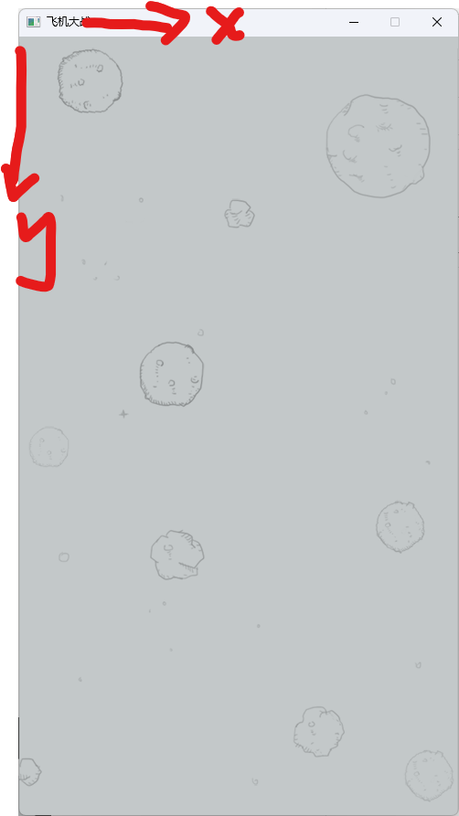
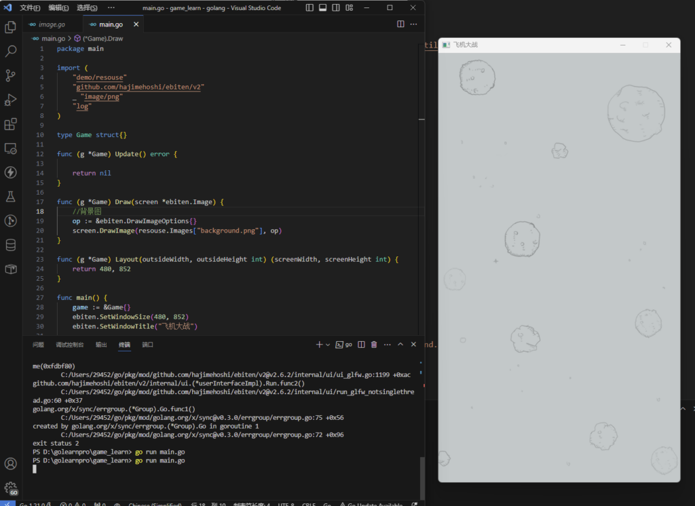

+++
date = '2023-04-06T23:30:51+08:00'
title = '用GO+Ebiten写一个飞机大战'
ShowToc  = true
tags = ["go"]
+++

# Ebitengine介绍
Ebitengine (旧称 Ebiten) 是一款由[Go 语言](https://golang.google.cn/)开发的开源游戏引擎。Ebitengine 的简单 API 可以让您的 2D 游戏开发更加简单快捷，并支持同时发布到多平台。

## 安装

```go
$ go get -u github.com/hajimehoshi/ebiten/v2
```


## 示例代码

```go
// Game implements ebiten.Game interface.
type Game struct{}

// Update proceeds the game state.
// Update is called every tick (1/60 [s] by default).
func (g *Game) Update() error {
    // Write your game's logical update.
    return nil
}

// Draw draws the game screen.
// Draw is called every frame (typically 1/60[s] for 60Hz display).
func (g *Game) Draw(screen *ebiten.Image) {
    // Write your game's rendering.
}

// Layout takes the outside size (e.g., the window size) and returns the (logical) screen size.
// If you don't have to adjust the screen size with the outside size, just return a fixed size.
func (g *Game) Layout(outsideWidth, outsideHeight int) (screenWidth, screenHeight int) {
    return 320, 240
}

func main() {
    game := &Game{}
    // Specify the window size as you like. Here, a doubled size is specified.
    ebiten.SetWindowSize(640, 480)
    ebiten.SetWindowTitle("Your game's title")
    // Call ebiten.RunGame to start your game loop.
    if err := ebiten.RunGame(game); err != nil {
        log.Fatal(err)
    }
}
```


## 框架结构

从上面的示例代码可以看出，Ebitengine的使用十分简单，我们只需要一个实现ebiten.Game这个接口的对象，将其传入RunGame即可。

```go
type Game interface {
	Update() error
	Draw(screen *Image)
	Layout(outsideWidth, outsideHeight int) (screenWidth, screenHeight int)
}
```


该接口定义了三个方法，其中

- Update() 方法在每一帧都会被调用，用于处理游戏的逻辑更新。我们可以在这个方法中处理玩家输入，游戏元素位置，碰撞检测等，它返回一个error

- Draw(screen *Image)方法在每一帧都会被调用，用于将游戏的当前状态渲染到屏幕上。我们可以在这里将游戏元素渲染到指定位置，每张图片按照渲染顺序依次覆盖。

- Layout(outsideWidth, outsideHeight int) (screenWidth, screenHeight int)方法用于定义游戏窗口的大小。当游戏窗口的大小发生变化时，Ebiten 会调用这个方法。
## 实现思路

### 静态资源读取

首先我们应该将静态资源，也就是游戏元素的图片在游戏初始化时加载到内存中，并封装成Ebitengine可以使用的形式，方便我们后续的调用。

```go
package resouse

import (
	"fmt"
	"image"
	"os"
	"path/filepath"

	"github.com/hajimehoshi/ebiten/v2"
)

// 保存所有静态资源
var Images = make(map[string]*ebiten.Image)

func init() {
	dir := "./assets"
	err := filepath.Walk(dir, func(path string, info os.FileInfo, err error) error {
		if err != nil {
			return err
		}
		if !info.IsDir() {
			// 如果文件不是目录，尝试加载它
			img, err := loadImage(path)
			if err != nil {
				fmt.Println("Failed to load image:", path)
			} else {
				// 将加载的图像存储在映射中，键是文件名
				Images[filepath.Base(path)] = img
			}
		}
		return nil
	})
	if err != nil {
		panic(err)
	}
}

func loadImage(filePath string) (*ebiten.Image, error) {
	// 打开图像文件
	f, err := os.Open(filePath)
	if err != nil {
		return nil, err
	}
	defer f.Close()

	// 解码图像文件
	img, _, err := image.Decode(f)
	if err != nil {
		return nil, err
	}

	// 将图像转换为 Ebiten 图像
	eImg := ebiten.NewImageFromImage(img)

	return eImg, nil
}
```


### 加入背景

首先我们先简单地在Draw()方法中给窗口加上背景，并将窗口大小设置为与背景图片大小一致。注意不要忘记引入**_ "image/png"**，这是为了正确加载png格式的图片。

```go
package main

import (
	"demo/resouse"
	"github.com/hajimehoshi/ebiten/v2"
	_ "image/png"
	"log"
)

type Game struct{}

func (g *Game) Update() error {

	return nil
}

func (g *Game) Draw(screen *ebiten.Image) {
	//背景图
	op := &ebiten.DrawImageOptions{}
	screen.DrawImage(resouse.Images["background.png"], op)
}

func (g *Game) Layout(outsideWidth, outsideHeight int) (screenWidth, screenHeight int) {
	return 480, 852
}

func main() {
	game := &Game{}
	ebiten.SetWindowSize(480, 852)
	ebiten.SetWindowTitle("飞机大战")

	if err := ebiten.RunGame(game); err != nil {
		log.Fatal(err)
	}
}
```


从中我们可以看出screen.DrawImage()方法用于将一张图片渲染到窗口上，其中ebiten.DrawImageOptions{}用于决定渲染参数。默认从窗口左上角为坐标原点算起，正方向如图所示




ebiten.DrawImageOptions{}中的**GeoM**表示图片的几何参数。

```go
type GeoM struct {
	a_1 float64 // The actual 'a' value minus 1
	b   float64
	c   float64
	d_1 float64 // The actual 'd' value minus 1
	tx  float64
	ty  float64
}
```


其中tx和ty即代表图片的位置坐标，默认为0，同样是以图片的左上角为基准。我们可以通过Translate()方法更改图片的坐标。

```go
// Translate translates the matrix by (tx, ty).
func (g *GeoM) Translate(tx, ty float64) {
	g.tx += tx
	g.ty += ty
}
```


#### 效果



### 加入英雄机

按照面向对象思维，我们应该新建一个Hero对象，这个对象的属性包括坐标，大小，背景图片等，以便于我们对其进行渲染和控制。

```go
type Hero struct {
	x             float64
	y             float64
	Img           *ebiten.Image
	Weight        int
	Height        int

}
```


#### 构造一个英雄机

我们希望英雄机的初始位置在屏幕正中心，所以在创建英雄机的时候，我们需要屏幕的宽高参数，同时，为了显示出英雄机的喷气效果，我们需要开启一个协程用于定时更新英雄机的背景图片。

```go
func NewHero(weight int, height int) *Hero {
    img := resouse.Images["hero1.png"]
    heroWeight := img.Bounds().Size().X
    heroHeight := img.Bounds().Size().Y
    Hero := &Hero{
        x:       float64(weight-heroWeight) / 2,
        y:       float64(height - heroHeight),
        Img:     img,
        Weight:  heroWeight,
        Height:  heroHeight,
    }
    go func() {
        //英雄机喷气效果
        ticker := time.NewTicker(70 * time.Millisecond)
        defer ticker.Stop()
        i := 1
        for range ticker.C {
            if i == 1 {
                Hero.Img = resouse.Images["hero1.png"]
            } else {
                Hero.Img = resouse.Images["hero0.png"]
            }
            i = 3 - i
        }
    }()
    return Hero

}
```


#### 渲染方法

```go
func (Hero *Hero) Draw(screen *ebiten.Image) {
	op := &ebiten.DrawImageOptions{}
	op.GeoM.Translate(Hero.x, Hero.y)
	screen.DrawImage(Hero.Img, op)
}
```


#### 效果

我们将这个英雄机加入到Game对象中，并在Draw方法中调用英雄机的Draw方法。

```go
package main

import (
	"demo/entity"
	"demo/resouse"
	_ "image/png"
	"log"

	"github.com/hajimehoshi/ebiten/v2"
)

type Game struct{
	hero      *entity.Hero
}

func (g *Game) Update() error {

	return nil
}

func (g *Game) Draw(screen *ebiten.Image) {
	//背景图
	op := &ebiten.DrawImageOptions{}
	screen.DrawImage(resouse.Images["background.png"], op)
	g.hero.Draw(screen)
}

func (g *Game) Layout(outsideWidth, outsideHeight int) (screenWidth, screenHeight int) {
	return 480, 852
}

func main() {
	game := &Game{hero: entity.NewHero(480, 852)}
	ebiten.SetWindowSize(480, 852)
	ebiten.SetWindowTitle("飞机大战")

	if err := ebiten.RunGame(game); err != nil {
		log.Fatal(err)
	}
}
```


可以看到喷气效果已经实现

#### 控制方法

我们可以通过 ebiten.IsKeyPressed()方法判断某个按键是否按下，来改变英雄机的坐标，从而控制移动。

当然，我做了一些限制，让英雄机无法移动出窗口的左右边界。

```go
func (Hero *Hero) Update() {
	if ebiten.IsKeyPressed(ebiten.KeyA) && Hero.x > 0 {
		Hero.x -= 2
	}
	if ebiten.IsKeyPressed(ebiten.KeyD) && Hero.x < float64(480-Hero.Weight) {
		Hero.x += 2
	}
	if ebiten.IsKeyPressed(ebiten.KeyW) {
		Hero.y -= 3
	}
	if ebiten.IsKeyPressed(ebiten.KeyS) {
		Hero.y += 1.5
	}

}
```


之后，在Game的Update方法中调用Herio的Update方法。

```go
func (g *Game) Update() error {
	g.hero.Update()
	return nil
}
```


#### 效果

### 加入敌机

同样定义一个结构体

```go
type AirPlane struct {
	X      float64
	Y      float64
	Img    *ebiten.Image
	Weight int
	Height int
}
```


#### 构造一个敌机

我们希望英雄机的位置时是随机出现在窗口上方的，所以构造函数的参数需要提供初始位置。

```go
func newAirPlane(x float64, y float64) *AirPlane {
	img := resouse.Images["airplane.png"]
	heroWeight := img.Bounds().Size().X
	heroHeight := img.Bounds().Size().Y
	airplane := &AirPlane{
		X:      x,
		Y:      y,
		Img:    img,
		Weight: heroWeight,
		Height: heroHeight,
	}

	return airplane
}
```


#### 开启一个协程用于敌机的随机定时生成

在Game对象中加入敌机，通过map保存所有的敌机，考虑到在敌机运动和生成敌机时可能会对敌机map产生并发访问问题，这里加入互斥锁。

```go
type Game struct {
	hero      *entity.Hero
	mu        *sync.Mutex
	airPlanes map[*entity.AirPlane]any
}
```


敌机生成函数

```go
func StartAirPlane(airplanes map[*AirPlane]any, mu *sync.Mutex) {
	go func() {
		ticker := time.NewTicker(300 * time.Millisecond)
		defer ticker.Stop()

		for range ticker.C {
			r := rand.New(rand.NewSource(time.Now().UnixNano()))
			x := r.Int63n(430)
			mu.Lock()
			airplanes[newAirPlane(float64(x), -20)] = struct{}{}
			mu.Unlock()
		}

	}()
}
```


#### 敌机的Update和Draw方法

```go
func (airplane *AirPlane) Update() {
    airplane.Y += 1.5
}

func (airplane *AirPlane) Draw(screen *ebiten.Image) {
    op := &ebiten.DrawImageOptions{}
    op.GeoM.Translate(airplane.X, airplane.Y)
    screen.DrawImage(airplane.Img, op)

}
```


#### 加入Game的Update和Draw方法中

```go
func (g *Game) Update() error {
	g.hero.Update()
	g.mu.Lock()

	for v := range g.airPlanes {
		v.Update()
	}
	g.mu.Unlock()

	return nil
}
```


```go
func (g *Game) Draw(screen *ebiten.Image) {
	//背景图
	op := &ebiten.DrawImageOptions{}
	screen.DrawImage(resouse.Images["background.png"], op)
	for v := range g.airPlanes {
		if v.Y > 860 {
                        //超出屏幕，清除这个敌机
			delete(g.airPlanes, v)
		}
		v.Draw(screen)
	}
	g.hero.Draw(screen)
}
```


#### 在主函数中启用敌机生成协程

```go
func main() {
	ebiten.SetWindowSize(480, 852)
	ebiten.SetWindowTitle("飞机大战")
	air := map[*entity.AirPlane]any{}
	game := &Game{hero: entity.NewHero(480, 852), mu: &sync.Mutex{}, airPlanes: air}
	entity.StartAirPlane(air, game.mu)
	if err := ebiten.RunGame(game); err != nil {
		log.Fatal(err)
	}
}
```


#### 效果

### 加入子弹

由于子弹的形成与英雄机的位置密切相关，在发射子弹时需要通过英雄机的位置计算子弹产生的位置，所以我们应该在英雄机的对象中加入子弹对象。

#### 子弹的初始化与Draw和Update方法

```go
type Bullet struct {
	X      float64
	Y      float64
	Img    *ebiten.Image
	Weight int
	Height int
}

func newBullet(x float64, y float64) *Bullet {
	img := resouse.Images["bullet.png"]
	bulletWeight := img.Bounds().Size().X
	bulletHeight := img.Bounds().Size().Y
	bullet := &Bullet{
		X:      x - float64(bulletWeight)/2 + 1,
		Y:      y - float64(bulletHeight)/2,
		Img:    img,
		Weight: bulletWeight,
		Height: bulletHeight,
	}

	return bullet
}

func (bullet *Bullet) Update() {
	bullet.Y -= 10
}

func (bullet *Bullet) Draw(screen *ebiten.Image) {
	op := &ebiten.DrawImageOptions{}
	op.GeoM.Translate(bullet.X, bullet.Y)
	screen.DrawImage(bullet.Img, op)
}
```


#### 在英雄机中加入子弹

这里我们使用map保存所有的子弹，更方便后续的删除操作，并且，玩过游戏的人都知道，任何攻击都是有冷却时间的，不会因为玩家的手速越快，攻击频率越高，所以，这里我们还加入一个时间参数，记录上一次英雄机的子弹发射时间，以便于设置发射冷却。

```go
type Hero struct {
	x             float64
	y             float64
	Img           *ebiten.Image
	Weight        int
	Height        int
	lastShootTime time.Time
	Bullets       map[*Bullet]any
}
```


注意不要忘记在英雄机初始化中，初始化子弹map

```go
Hero := &Hero{
		x:       float64(weight-heroWeight) / 2,
		y:       float64(height - heroHeight),
		Img:     img,
		Weight:  heroWeight,
		Height:  heroHeight,
		Bullets: map[*Bullet]any{},
	}
```


英雄机的Update方法，加入子弹发射。

```go
func (Hero *Hero) Update() {
	if ebiten.IsKeyPressed(ebiten.KeyA) && Hero.x > 0 {
		Hero.x -= 2
	}
	if ebiten.IsKeyPressed(ebiten.KeyD) && Hero.x < float64(480-Hero.Weight) {
		Hero.x += 2
	}
	if ebiten.IsKeyPressed(ebiten.KeyW) {
		Hero.y -= 3
	}
	if ebiten.IsKeyPressed(ebiten.KeyS) {
		Hero.y += 1.5
	}

	if ebiten.IsKeyPressed(ebiten.KeyJ) {
		if time.Since(Hero.lastShootTime).Seconds() >= 0.2 {
			bullet := newBullet(Hero.x+float64(Hero.Weight)/2+32, Hero.y+40)
			Hero.Bullets[bullet] = struct{}{}
			bullet = newBullet(Hero.x+float64(Hero.Weight)/2-32, Hero.y+40)
			Hero.Bullets[bullet] = struct{}{}
			Hero.lastShootTime = time.Now() // 更新时间戳
		}
	}

}
```


更新主函数

```go
func (g *Game) Update() error {
	g.hero.Update()
	g.mu.Lock()
	for v := range g.hero.Bullets {
		v.Update()
	}
	for v := range g.airPlanes {
		v.Update()
	}
	g.mu.Unlock()
	return nil
}

func (g *Game) Draw(screen *ebiten.Image) {
	//背景图
	op := &ebiten.DrawImageOptions{}
	screen.DrawImage(resouse.Images["background.png"], op)
	g.mu.Lock()
	for v := range g.hero.Bullets {
		if v.Y < -10 {
			delete(g.hero.Bullets, v)
		}
		v.Draw(screen)
	}
	for v := range g.airPlanes {
		if v.Y > 860 {
			delete(g.airPlanes, v)
		}
		v.Draw(screen)
	}
	g.mu.Unlock()
	g.hero.Draw(screen)
}
```


#### 效果

### 碰撞检测

现在已经有了子弹发射和敌机，当子弹与敌机重叠时，我们删除这两个元素，实现碰撞检测。

#### 碰撞检测函数

```go
func checkCollision(airplane *entity.AirPlane, bullet *entity.Bullet) bool {
	return !(airplane.X > bullet.X+float64(bullet.Weight) ||
		airplane.X+float64(airplane.Weight) < bullet.X ||
		airplane.Y > bullet.Y+float64(bullet.Height) ||
		airplane.Y+float64(airplane.Height) < bullet.Y)
}
```


#### 在Draw中加入判断逻辑

```go
for air := range g.airPlanes {
		for bul := range g.hero.Bullets {
			if checkCollision(air, bul) {
				delete(g.hero.Bullets, bul)
				delete(g.airPlanes, air)
			}
		}
	}
```


#### 效果

# 在web上运行

wasm不支持读取本地静态文件，所以我们需要将图片编译到wasm里面，这里我们用到Ebitengine官方开发的工具file2byteslice，它可以将静态资源转换为go文件以byte保存。

```go
git clone https://github.com/hajimehoshi/file2byteslice
cd ./file2byteslice/cmd/file2byteslice
go build -o file2byteslice.exe
```


编译好的程序就可以实现我们想要的功能了。

```go
file2byteslice -input INPUT_FILE -output OUTPUT_FILE -package PACKAGE_NAME -var VARIABLE_NAME
INPUT_FILE 输入的资源文件
OUTPUT_FILE 输入的Go文件
PACKAGE_NAME 包名
VARIABLE_NAME 变量名
```


引用示例

```go
	img, _, _ := ebitenutil.NewImageFromReader(bytes.NewReader(assets.ImgAirPlane))
```


# 总结

使用Ebitengine写一个小游戏还是比较简单的，或许开发小游戏，对于编程初学者来说有很强的正反馈，我们可以用代码操作游戏世界的事物，感受编程乐趣。

后续可能会研究一下联机游戏的实现思路，Go语言做网络游戏的服务端应该还是比较合适的，无论从开发效率还是从性能上来看。


