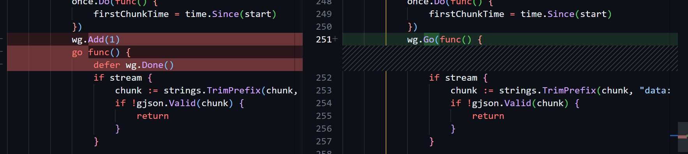

+++
date = '2025-08-13T10:18:17+08:00'
title = 'Go1.25值得关注的三点'
+++

## 更新到go1.25 只需这三行命令即可
```bash
wget https://dl.google.com/go/go1.25.0.linux-amd64.tar.gz
rm -rf /usr/local/go
tar -C /usr/local -xzf go1.25.0.linux-amd64.tar.gz
```


## [sync.WaitGroup](https://pkg.go.dev/sync#WaitGroup)
```go
func (wg *WaitGroup) Go(f func()) {
	wg.Add(1)
	go func() {
		defer wg.Done()
		f()
	}()
}
```
新增了一个Go方法，简单封装了原来略显麻烦的使用方式。


## [synctest](https://pkg.go.dev/testing/synctest)
全新的专用于测试并发代码的包。

## [GOMAXPROCS](https://go.dev/doc/go1.25#container-aware-gomaxprocs)
现在，GOMAXPROCS会优先根据 cgroup CPU 设置的带宽限制设置数量。