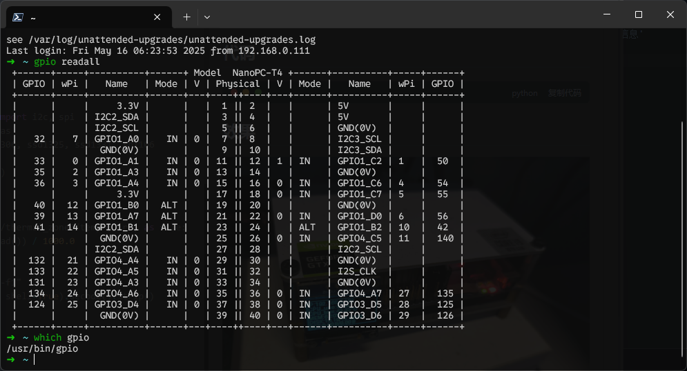
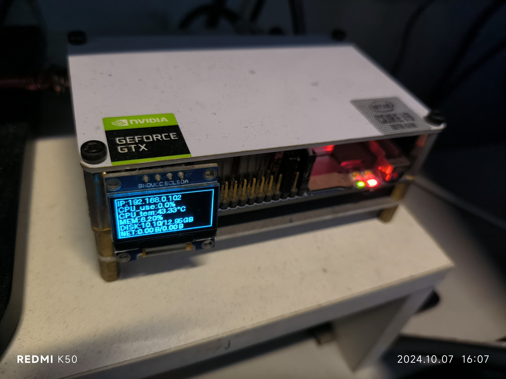

+++
date = '2023-12-26T22:41:36+08:00'
draft = true
title = '使用Python在0.96oled上显示状态信息'
tags = ["python","linux"]
+++
## 查看引脚定义

## 依赖安装
```bash
pip install psutil luma.core luma.oled
```
## 代码
```python
import subprocess
import time
import socket
import psutil
from luma.core.interface.serial import i2c, spi
from luma.core.render import canvas
from luma.oled.device import ssd1306, ssd1325, ssd1331, sh1106
 
serial = i2c(port=2, address=0x3C)
device = ssd1306(serial)
 
def get_cpu_temperature():
    with open('/sys/class/thermal/thermal_zone0/temp', 'r') as file:
        temperature = int(file.read()) / 1000.0
    return temperature
 
cmd = "hostname -I | cut -d\' \' -f1"
IP = subprocess.check_output(cmd, shell=True).decode().strip()
 
    # 将字节转换为 GB
def bytes_to_gb(bytes):
    return bytes / (1024 ** 3)
 
# 将字节转换为合适的单位
def convert_size(size):
    # 定义单位列表
    units = ['B', 'KB', 'MB', 'GB', 'TB']
 
    # 迭代转换单位直到小于1024
    for unit in units:
        if size < 1024:
            return f"{size:.2f} {unit}"
        size /= 1024
 
    return f"{size:.2f} {units[-1]}"
 
# 获取初始的输入输出流量
net_io_start = psutil.net_io_counters()
 
while True:
    with canvas(device) as draw:
        cmd = "hostname -I | cut -d\' \' -f1"
        current_IP = subprocess.check_output(cmd, shell=True).decode().strip()
        timestamp_start = time.time()
 
        # 等待一秒钟
        time.sleep(1)
        
        cpu_usage = psutil.cpu_percent(interval=1)
        cpu_temperature = get_cpu_temperature()
 
        # 获取内存占用情况
        memory = psutil.virtual_memory()
 
        # 获取总内存大小（以 GB 为单位）
        total_memory = bytes_to_gb(memory.total)
 
        # 获取可用内存大小（以 GB 为单位）
        available_memory = bytes_to_gb(memory.available)
 
        # 获取已使用内存大小（以 GB 为单位）
        used_memory = bytes_to_gb(memory.used)
 
        # 获取内存使用率
        memory_usage = memory.percent
 
        disk = psutil.disk_usage('/')
        total_disk = bytes_to_gb(disk.total)
        free_disk = bytes_to_gb(disk.free)
 
        # 获取当前的输入输出流量和时间戳
        net_io_current = psutil.net_io_counters()
        timestamp_current = time.time()
 
        # 计算时间间隔
        time_interval = timestamp_current - timestamp_start
 
        # 计算上行和下行网速
        upload_speed = (net_io_current.bytes_sent - net_io_start.bytes_sent) / time_interval 
        download_speed = (net_io_current.bytes_recv - net_io_start.bytes_recv) / time_interval
        upload_speed = upload_speed / 2
 
        # 切换单位
        upload_speed = convert_size(upload_speed) 
        download_speed = convert_size(download_speed)
 
 
        # 更新初始的输入输出流量
        net_io_start = net_io_current
 
        draw.rectangle(device.bounding_box, outline="white", fill="black") # 让屏幕周围显示一个框
        draw.text((2,1),f"IP:{current_IP}",fill="white")
        draw.text((2,11),f"CPU_use:{cpu_usage}%",fill="white")
        draw.text((2,21),f"CPU_tem:{cpu_temperature:.2f}°C",fill="white")
        draw.text((2,31),f"MEM:{memory_usage:.2f}%",fill="white")
        draw.text((2,41), f"DISK:{free_disk:.2f}/{total_disk:.2f}GB", fill="white")
        draw.text((2,51), f"NET:{upload_speed}/{download_speed}", fill="white")
```
## 运行
