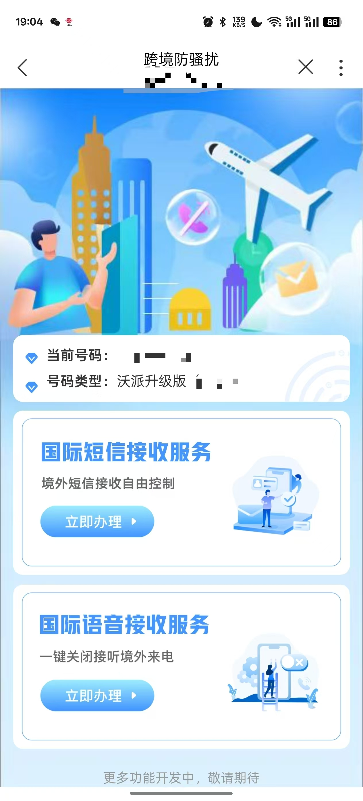
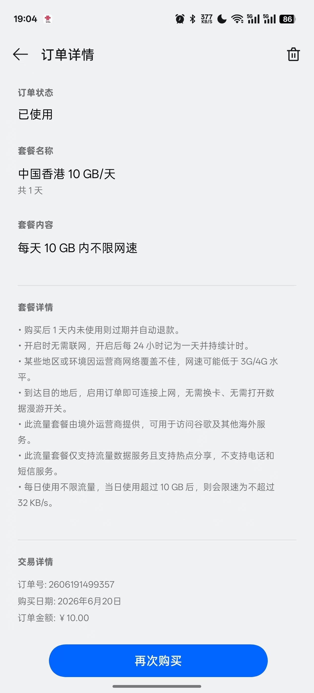
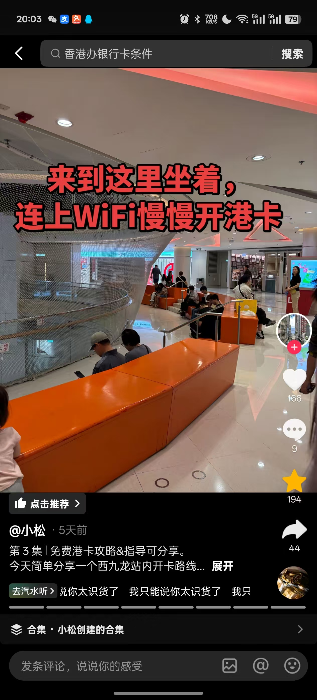
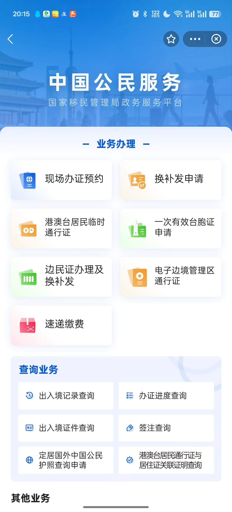
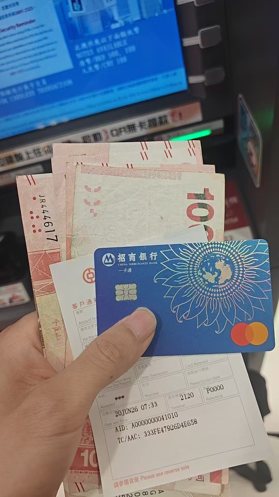
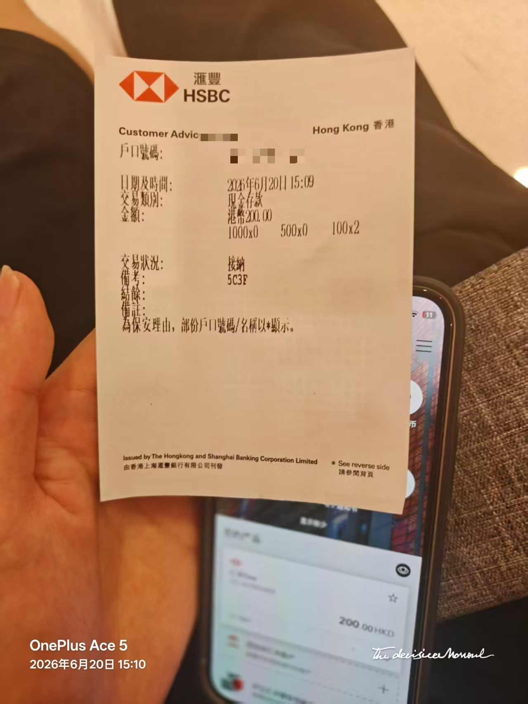

+++
date = '2026-06-22T18:54:25+08:00'
title = '香港一日游（港卡，购物攻略）'
+++

前几天端午节，想去香港开个港卡顺便转一圈，总结一下我的从交通到办卡的完整攻略。

# 去前准备
- 身份证
- 港澳通行证+有效签注
- 手机卡开通国际漫游+购买境外流量包

  
  

- visa/万事达银行卡（可选）

# 去行
从上海出发，浦东国际机场—>✈️->宝安国际机场->🚌(夜间线na1)->投资大厦->🚶->福田站->🚄->西九龙站（早上7点左右），全程花费440+20+68。

# 西九龙抵港
根据指示牌用身份证+港澳通行证过关后，第二次刷港澳通行证会获取一个入境小票，保存好。

通关后，根据指示牌前往圆方方向，会看见这个地方，这时是最适合办卡的。

此处有座位+免费wifi(30分钟重新认证)+中银ATM机+汇丰ATM机。

到此后，可以打开之前办理通行证的程序，点击出入境记录查询，等待出镜记录更新，然后下载，下载后的文件不要修改文件名字，原封不动留在手机中，办港卡必备证明文件。

汇丰注意办卡的时候职业选学生，收入填最低，其他众安象象蚂蚁银行这种没什么需要注意的，秒过。

在中银ATM机，可以用招商万事达取现港币，首次取现免手续费，实时汇率，香港部分商店只收取现金。

如果秒过了汇丰账户，同时玩完香港后回到西九龙站的时候现金没有花完，可以通过此处的汇丰ATM机无卡存款（最低面额100hkd），输入账户名即可。

# 吃+逛
## 尖沙咀
## 星光大道
## 维多利亚港
## 天星小轮
## 重庆大厦