+++
date = '2025-08-10T17:03:30+08:00'
title = '零成本搭建个人LLM路由网关'
+++

简单总结一下我是如何使用各家的大语言模型api的，之前很长一段时间使用newapi聚合各家免费的api。但是现在，主流厂商基本都已经支持openai格式调用，而且对于个人来讲，newapi很多功能都是冗余的，所以想自己写一个api负载均衡满足日常使用。
# llmio
我将这个项目命名为[llmio](https://github.com/atopos31/llmio)，后端由go语言实现，前端由qwen3-code + vibe coding实现，只支持openai格式。项目十分简单，通过单独设置model与provider，一个model对应n个provider。
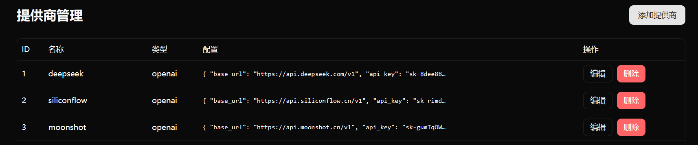
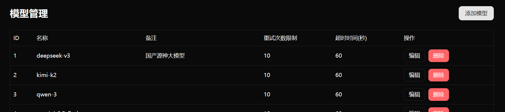
每次接收到请求根据不同provider的权重随机选择一个，替换请求体中的原始model字段为provider设置的model，并使用go标准库的io.TeeReader(body, pw)将响应body流同时转发给客户端与日志记录。
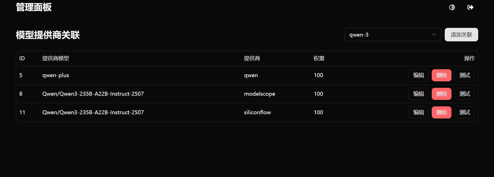
最高效实现负载均衡代理的同时，也方便开发者查看每次请求的各种数据。
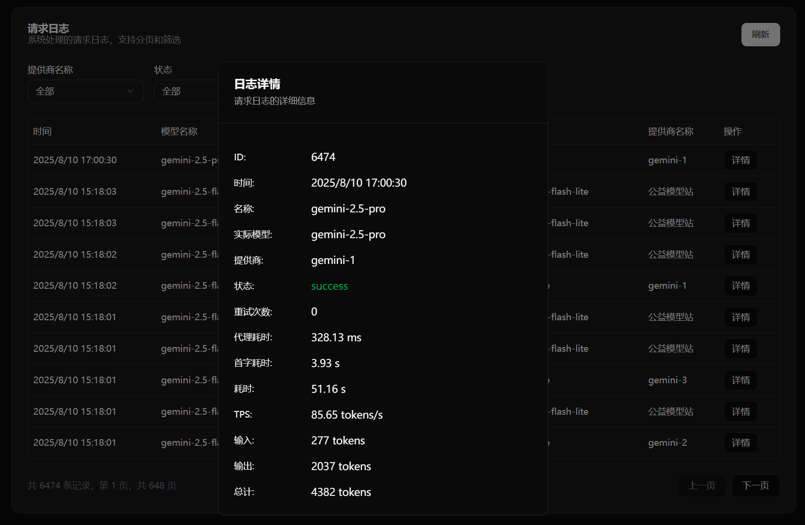
# 部署
项目使用github action自动构建了docker镜像，最新版为0.2.3，可以使用docker compose一键部署，数据使用sqllite保存在/app/db文件夹下的llmio.db文件中，方便一键迁移。内存占用在20m左右，十分轻量。
```yaml
services:
  llmio:
    image: atopos31/llmio:latest
    ports:
      - 7070:7070
    volumes:
      - ./db:/app/db
    environment:
      - GIN_MODE=release
      - TOKEN=<YOUR_TOKEN>
```
当然，如果你没有云服务器，推荐使用[sealos](https://cloud.sealos.run/?uid=gzBxQRYlvP)部署，注册就送10元额度，每天仅需0.08元。
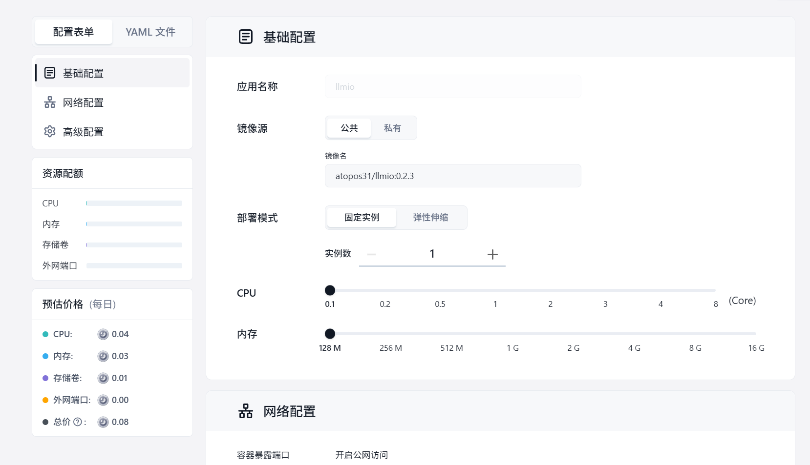
注意，环境变量中的TOKEN同时负责api以及后台管理的鉴权。
# 日用推荐
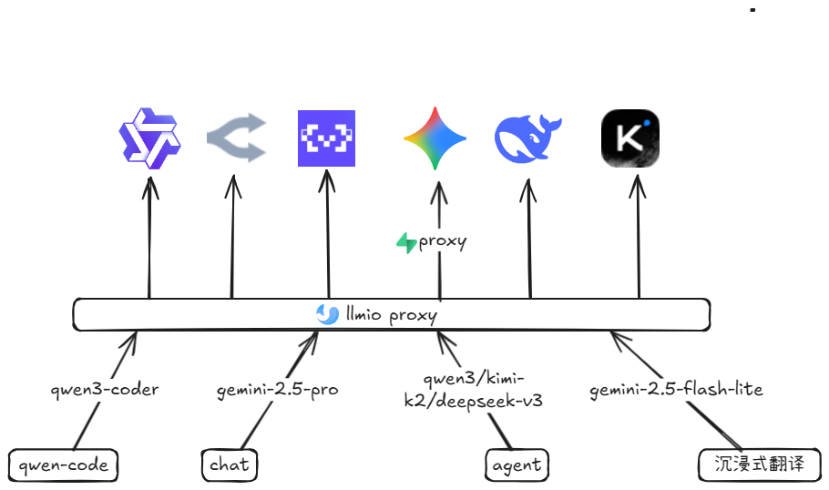
## qwen3-coder
可以选择魔搭提供的每日2000次免费api或者openrouter的qwen3-coder:free，主要结合qwen-code cli来进行代码编写，效果十分不错。
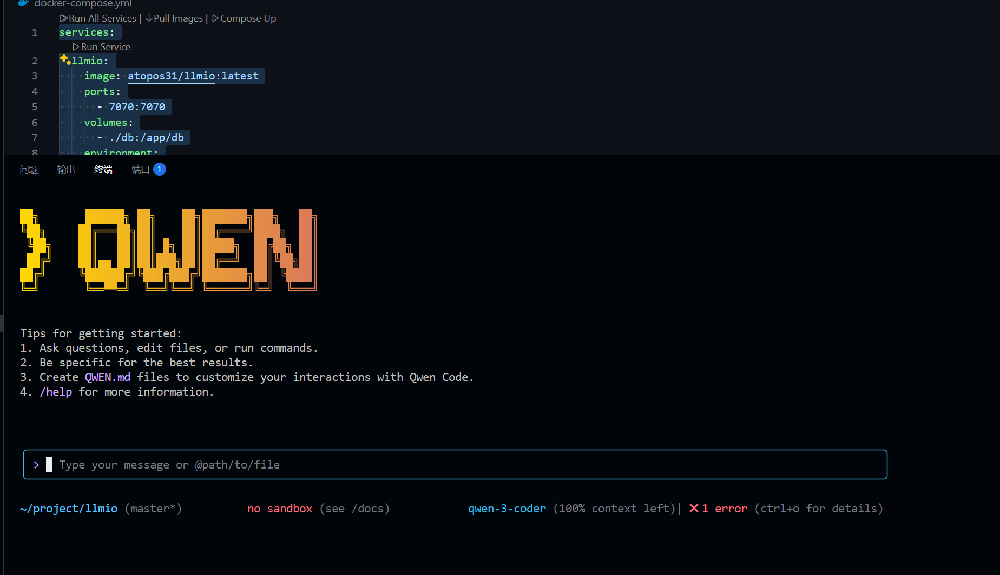
## gemini-2.5-pro
目前最强的大语言模型，非常适合日常问题解答，缺点是响应比较慢，国内使用还需要代理。
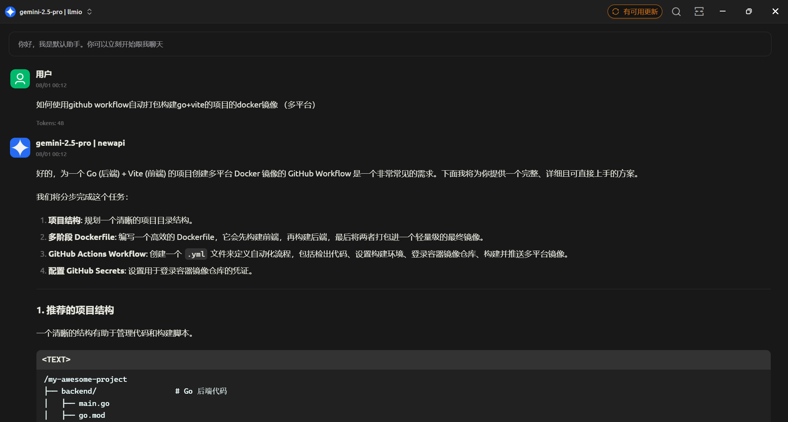
我使用的是[supabase](https://supabase.com/)提供的edge function实现代理，出口ip数量很多，可以有效避免gooogle对于单一ip多key轮询的封禁。
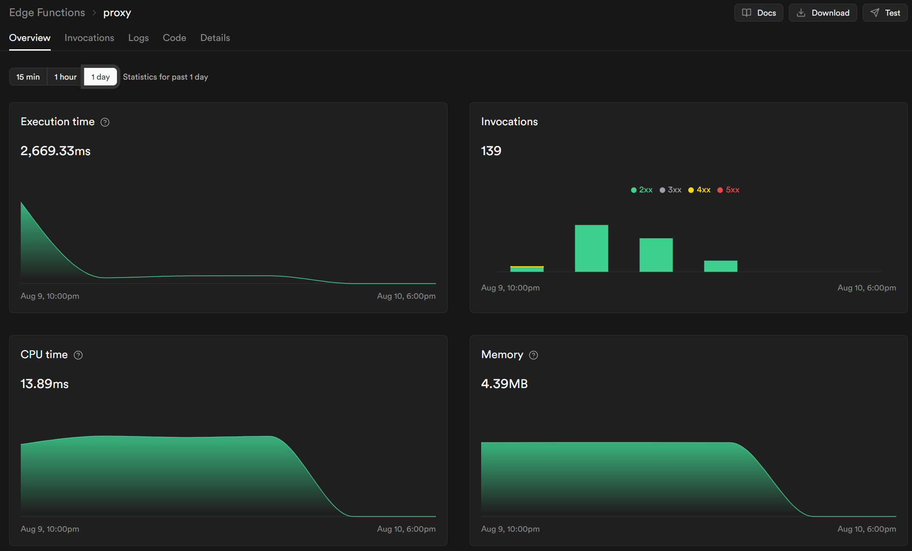
```ts
// Setup type definitions for built-in Supabase Runtime APIs
import "jsr:@supabase/functions-js/edge-runtime.d.ts";
console.info('server started');
const proxies = {
  gemini: "https://generativelanguage.googleapis.com",
  vertex: "https://aiplatform.googleapis.com",
  api: "https://www.googleapis.com"
};
Deno.serve(async (req)=>{
  const { pathname } = new URL(req.url);
  const allurl = pathname.replace("/proxy/", "");
  const target = allurl.split("/")[0];
  const targetHost = proxies[target];
  if (!targetHost) {
    return fetch("https://ip.heyxiao.top", {
      method: req.method,
      body: req.body,
      redirect: "manual"
    });
  }
  const targetUrl = `${targetHost}${allurl.replace(`${target}`, "")}`;
  const headers = new Headers(req.headers);
  headers.set("Host", targetHost);
  console.log(targetUrl);
  return fetch(targetUrl, {
    method: req.method,
    headers,
    body: req.body,
    redirect: "manual"
  });
});
```
其中的proxy可以替换为你的自定义函数名称，base_url配置为
```bash
https://xxx.supabase.co/functions/v1/proxy/gemini/v1beta/openai
```
xxx为新建函数时随机生成，注意关闭鉴权
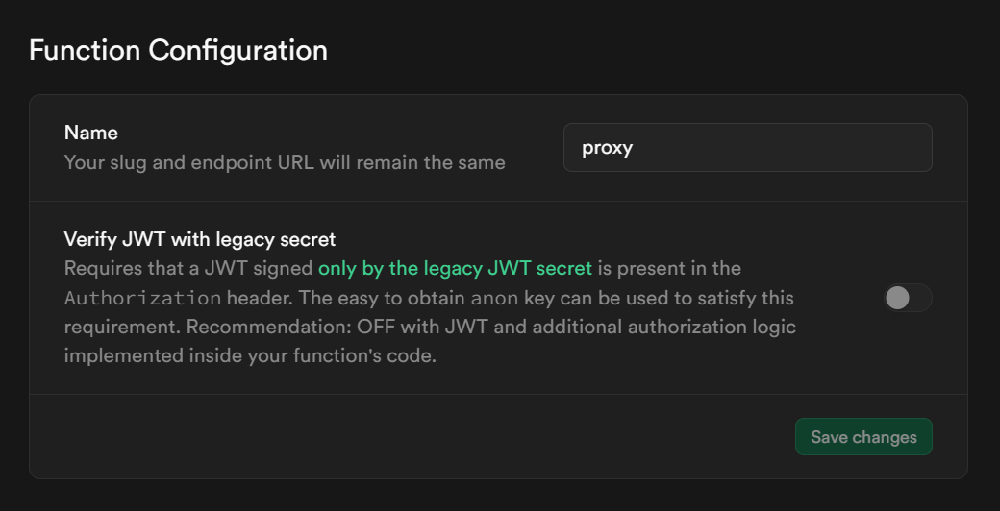
## qwen3/kimi-k2/deepseek-v3
这一类模型都为开源模型，除了官方之外一般都有第三方提供api，用来做agent开发，调用工具使用非常不错。
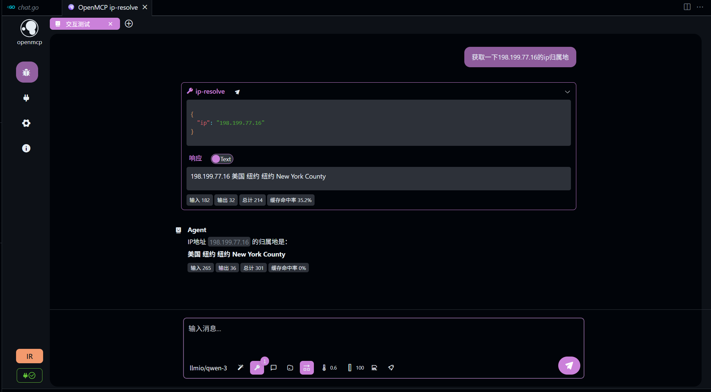
## gemini-2.5-flash-lite
被很多人忽视的模型,google ai studio免费额度最多的模型，响应快，很适合沉浸式翻译这种高并发场景。
