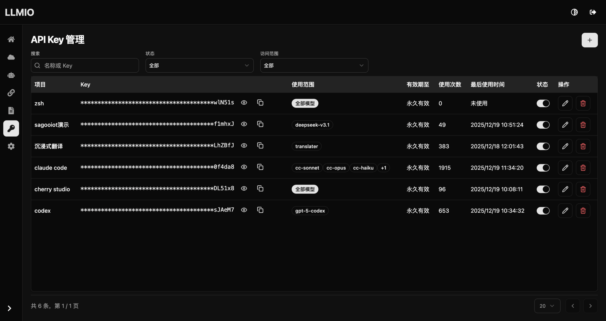
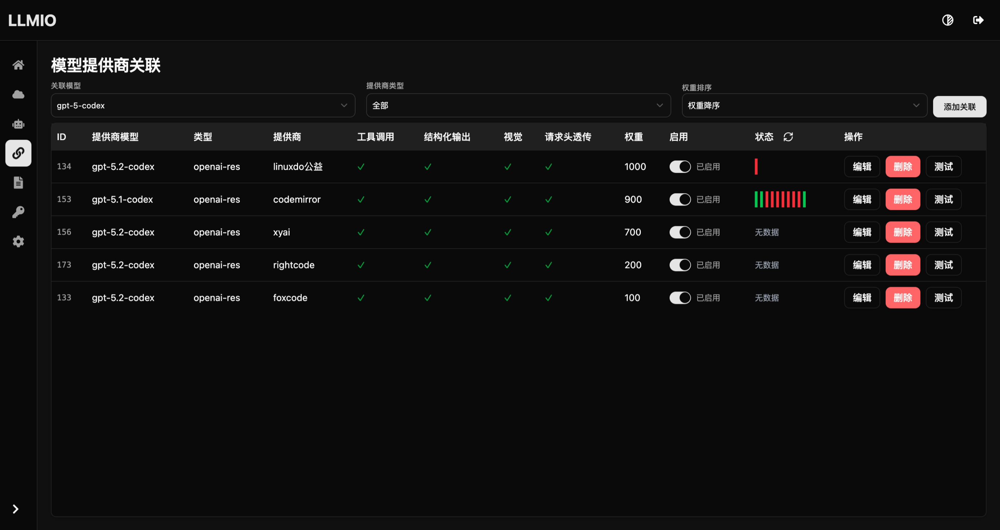
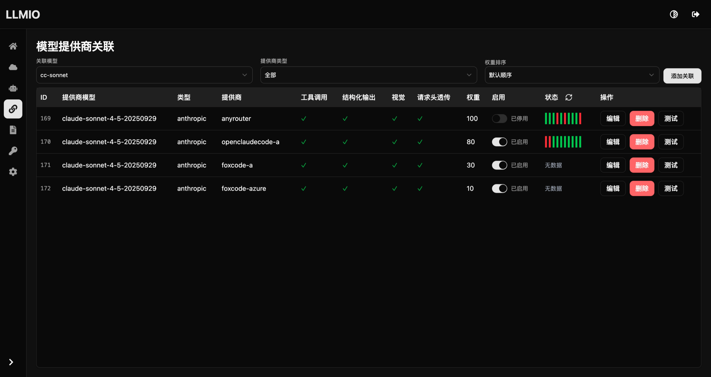
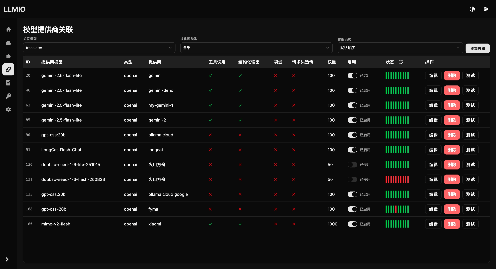
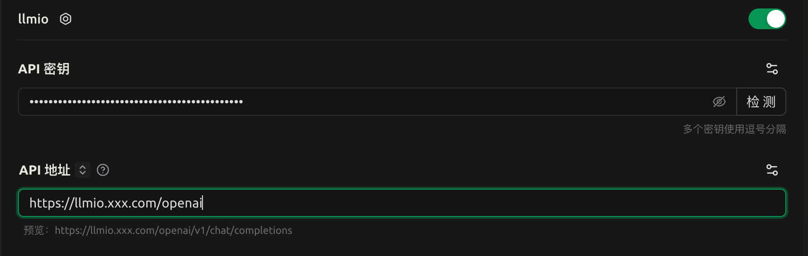
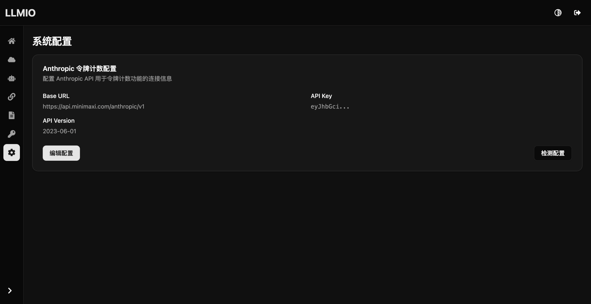
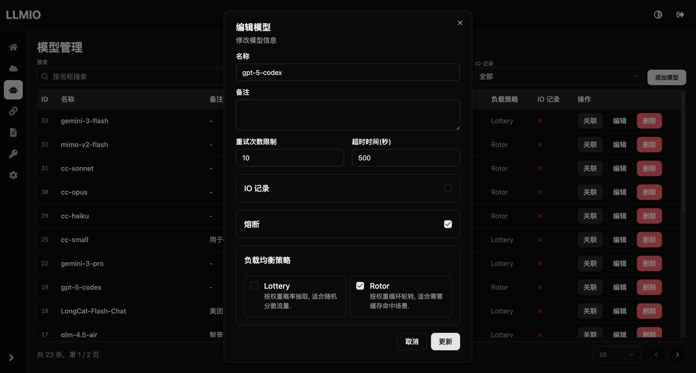

+++
date = '2025-12-19T11:20:48+08:00'
title = 'LLLMIO 全新的 LLM API 负载均衡网关'
+++

经过几个月的更新 现在 LLMIO 的功能应该是很完善了
[github开源地址](https://github.com/atopos31/llmio)
总结一些使用 LLMIO 最佳实践

## API KEY 管理
为了统计不同项目对接 LLMIO 的使用情况, 应该为每个项目/客户端分配独立的 API KEY 并限制访问的模型范围, 必要的时候可以设置过期时间, 这样可以降低因为密钥泄漏的带来的损失.


## 客户端配置
### codex
配置文件位置: `~/.codex/config.toml`

```toml
model_provider = "codex"
model = "gpt-5-codex"
model_reasoning_effort = "high"
disable_response_storage = true
[model_providers.codex]
name = "codex"
base_url = "https://llmio.xxx.com/openai/v1"
wire_api = "responses"
env_key = "OPENAI_CODEX_API_KEY"
```

自行配置 `OPENAI_CODEX_API_KEY` 环境变量

新建模型 `gpt-5-codex`, 负载均衡策略推荐使用 `Rotor` , 同时关联你的上游.


### claude code
claude code可以完全使用环境变量配置(推荐) , 使用 LLMIO 之后, 应该不会再有通过 cli 切换的情况

配置环境变量
```bash
export ANTHROPIC_BASE_URL=https://llmio.xxx.com/anthropic
export ANTHROPIC_API_KEY=YOUR_API_KEY
export ANTHROPIC_MODEL=cc-sonnet
export ANTHROPIC_SMALL_FAST_MODEL=cc-small
export ANTHROPIC_DEFAULT_HAIKU_MODEL=cc-haiku
export ANTHROPIC_DEFAULT_OPUS_MODEL=cc-opus
export ANTHROPIC_DEFAULT_SONNET_MODEL=cc-sonnet
```
同时在llmio中新建上面的四个模型，关联到对应提供商模型, 这里以 cc-sonnet 为例


### 沉浸式翻译
对于沉浸式翻译这种对提供商质量要求不高, 但是并发高的客户端, 推荐关联一些免费快速成本低的模型, 同时负载均衡策略使用 `Lottery`


### Cherry Studio
简单配置即可


## Anthropic令牌计数配置
部分Anthropic上游不支持此接口, 所以 LLMIO 改为自定义此接口的上游, 接口主要用于claude code的/context统计上下文使用.


## 熔断
可以降低轮询重复测试上游反复错误重试的问题, 必要时可以开启.

## 注意事项
- 部分上游可能不遵循标准鉴权 此时可以通过模型提供商关联编辑页面的自定义请求头实现

