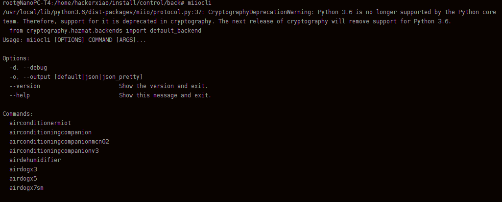
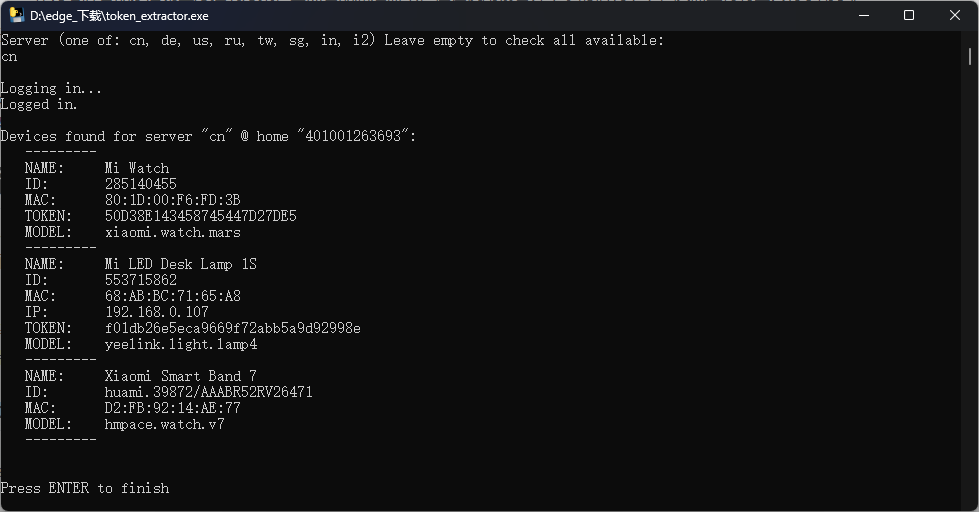

+++
date = '2023-05-23T23:17:43+08:00'
title = 'Miio操作米家台灯'
+++

python-miio 是一个由第三方实现的开源 miIO / MIoT 协议库，兼容大多数小米IoT智能家居设备，python-miio 还附带提供了基于命令行的调试工具 miiocli，供感兴趣的终端用户直接进行调用，本文将作为重点进行讲解。

# 先决条件
局域网内一台安装python环境的主机。

**下面是我的配置**

- 主机：nanopc-t4

- 系统：unbuntu18.04

- Python版本：3.6.8

## 安装python-miio库

```SQL
sudo pip3 install python-miio
```


如果没有pip3工具请先安装python-pip3

```SQL
sudo apt-get install python-pip3
```


安装完成后，输入miiocli，如图所示即可。


## 获取设备信息

[点击下载token_extractor](https://github.com/PiotrMachowski/Xiaomi-cloud-tokens-extractor/releases/latest/download/token_extractor.exe)

按照命令行提示输入你的账号密码以及国家即可。


# 开始操作
米家台灯属于wifi直连的米家设备，可以通过plug指令进行控制，目前我只尝试过三种指令，获取设备状态，开灯，关灯。
根据`miio plug --help`的提示信息，plug类型设备支持下列操作：

```SQL
Commands:
  info          Get miIO protocol information from the device.
  off           Power off.
  on            Power on.
  raw_command   Send a raw command to the device.
  set_wifi_led  Set the wifi led on/off.
  status        Retrieve properties.
  usb_off       Power off.
  usb_on        Power on.
```


### 更新

针对于米家的灯系列–yeelight，其实有更详细的的操作
miiocli yeelight

```SQL
Options:
  --ip TEXT     [required]
  --token TEXT  [required]
  --model TEXT
  --help        Show this message and exit.

Commands:
  dump_ble_debug            Dump the BLE debug table, defaults to...
  info                      Get (and cache) miIO protocol information...
  off                       Power off.
  on                        Power on.
  raw_command               Send a raw command to the device.
  set_brightness            Set brightness.
  set_color_temp            Set color temp in kelvin.
  set_default               Set current state as default.
  set_developer_mode        Enable or disable the developer mode.
  set_name                  Set an internal name for the bulb.
  set_rgb                   Set color in RGB.
  set_save_state_on_change  Enable or disable saving the state on changes.
  status                    Retrieve properties.
  test_properties           Helper to test device properties.
  toggle                    Toggle bulb state.
```


### 查看状态

```SQL
root@NanoPC-T4:~# miiocli yeelight --ip 192.168.0.107 --token f01db26e5eca9669f72abb5a9d92998e status
/usr/local/lib/python3.6/dist-packages/miio/protocol.py:37: CryptographyDeprecationWarning: Python 3.6 is no longer supported by the Python core team. Therefore, support for it is deprecated in cryptography. The next release of cryptography will remove support for Python 3.6.
  from cryptography.hazmat.backends import default_backend
Name: 
Update default on change: False
Delay in minute before off: 0
Main light
   Power: True
   Brightness: 100
   Color mode: ColorTemperature
   Temperature: 3900
   Color flowing mode: False
```


通过上面的设置指令以及对应状态，即可设置开关，亮度，色温等。

### 查看设备状态

**miiocli plug --ip 192.168.0.107 --token f01db26e5eca9669f72abb5a9d92998e status**

### 开灯

**miiocli plug --ip 192.168.0.107 --token f01db26e5eca9669f72abb5a9d92998e on**

### 关灯

**miiocli plug --ip 192.168.0.107 --token f01db26e5eca9669f72abb5a9d92998e off**

# 于是，我们就可以这样控制


