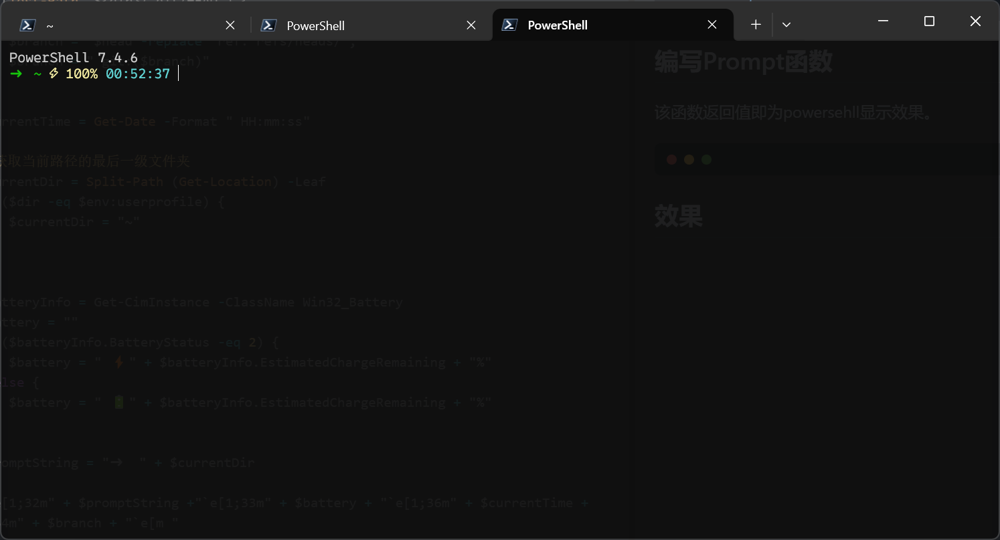

+++
date = '2025-05-22T23:50:43+08:00'
title = 'Powershell美化'
+++

## 使用vscode打开配置文件
```bash
code $PROFILE
```
## 编写Prompt函数
该函数返回值即为powersehll显示效果。
```powershell
function Prompt {
    $dir = $PWD.Path
    $branch = ""
    if (Test-Path "${dir}/.git/HEAD") {
        $head = Get-Content "${dir}/.git/HEAD"
        $branch =  $head -replace 'ref: refs/heads/', ''
        $branch = " git:($branch)"
    }

    $currentTime = Get-Date -Format " HH:mm:ss"

    # 获取当前路径的最后一级文件夹
    $currentDir = Split-Path (Get-Location) -Leaf
    if ($dir -eq $env:userprofile) {
        $currentDir = "~"
    }


    $batteryInfo = Get-CimInstance -ClassName Win32_Battery
    $battery = ""
    if ($batteryInfo.BatteryStatus -eq 2) {
        $battery = " ⚡" + $batteryInfo.EstimatedChargeRemaining + "%"
    } else {
        $battery = " 🔋" + $batteryInfo.EstimatedChargeRemaining + "%"
    }

    $promptString = "➜  " + $currentDir

    "`e[1;32m" + $promptString +"`e[1;33m" + $battery + "`e[1;36m" + $currentTime + "`e[1;34m" + $branch + "`e[m "
}
```
## 效果


