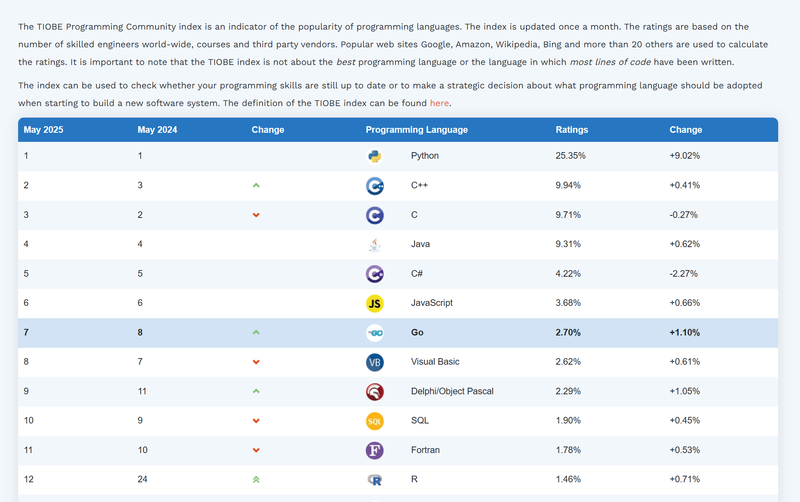

+++
date = '2025-06-04T23:40:19+08:00'
title = '为什么选择Golang?'
+++

**假设你作为一个小白去论坛上问，我应该学习那门编程语言？**

有人可能会说，你必须去学C语言！因为这个世界上所有软件底层都是C写的！不懂C语言的不是一个合格的程序员！还有人可能会说，来学Python吧，Python入门简单，可以很快让你感受到编程的乐趣，也有人会让你学习Java，然后什么跨平台啊，一次编写到处运行，面向对象哦，巴拉巴拉。。。

相信这是大多数人的回答，很多人说C/C++的性能好但是学起来难，Python语言简单易学但是性能差，js从前端客户端到后台，全是js实现，Java可以一次编写到处运行，但是同js一样拖着虚拟机，吃内存！

那么，有没有一种语言，既有高性能，又有简单的语法，还方便跨平台，并且不用拖着笨重的运行时/虚拟机吃内存呢？

有的兄弟，有的，不过像这么优秀的语言可没有9门，恰好呢本文的主角Golang满足了这些苛刻的要求。

> 在2025年的今天，Golang在TIOB排行第7名，并且仍保持上升的趋势，成为最流行的编程语言之一。

# 一门简单的语言
那有人要问，Golang它怎么就简单了？这里我要说，一门语言的简单应该体现在多个方面。
## 快速搭建开发环境
如果你学过c/c++，你就会发现搭建开发环境实在是很复杂，比如，gcc和clang？选哪个编译器？makefile是什么？我怎么代码补全？怎么有些ide还内置编译器啊？卧槽你用的什么C标准，我编译不过去！

如果是Golang，那你和我的go run说去吧，一键安装sdk，gopls现代化lsp帮你补全代码，版本随便升级，依旧编译成功！
## 现代化，统一的包管理器
c/c++: 我想找个三方库，一会cmake一会xmake，不同系统还有不同的标准库！

Python: conda?  pip? uv? venv虚拟环境？怎么包都是c/c++写的啊，乱七八糟！

Java: gradle? maven? 我的JDBC升级了怎么连接不上数据库？

js: npm? yarn? node？浏览器？我的npm包又冲突了！

//未完待续

